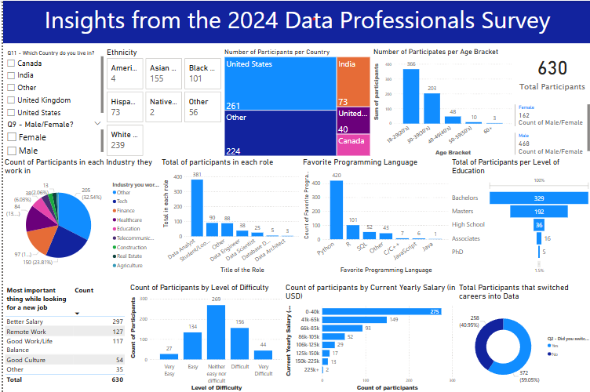

# Data Professionals Survey 2024 – Power BI Dashboard

This Power BI dashboard explores insights from the 2024 Data Professionals Survey. It visualizes trends and experiences shared by data professionals worldwide, highlighting roles, tools, education, and career journeys in the field.

---

## 📊 What's Inside

This report answers questions like:

- 🌍 Where do data professionals work?
- 👔 What roles and industries are they in?
- 💻 What are the most-used programming languages?
- 🎓 What are their education levels and salary ranges?
- 🔄 How difficult was it to break into data?
- 💼 What motivates them to switch jobs?

---

## 📁 Files in This Folder

- `Data Professionals Survey Dashboard.pbix`: Power BI dashboard file
- `Screenshot.png`: A preview of the report design

---

## 🛠️ Tools & Techniques

- Excel
- Power BI Desktop
- Data transformation with Power Query
- DAX for calculated measures and sorting logic
- Report design for clear, structured storytelling

---

## 📷 Dashboard Preview

---

## 📌 Key Insights

- Most participants are **Data Analysts** in the **U.S. and India**
- **Python** tops the list of preferred programming languages
- Many transitioned into data roles from other fields
- The majority found the switch **moderately difficult**
- **Better salary** is the top reason for job changes

---

## 🔗 Back to Repository

Return to the main collection of Power BI projects:  
[🔙 Power BI Repository](https://github.com/MercyBundi/PowerBI/tree/main)

---

## 📬 Connect With Me

I'd love to hear your thoughts, feedback, or opportunities to collaborate.

💼 [LinkedIn Profile](https://ke.linkedin.com/in/mercy-bundi-5931961b8)

---

## 🔖 Tags

`#PowerBI` `#DataAnalytics` `#SurveyAnalysis` `#DataCareers` `#DashboardDesign`

